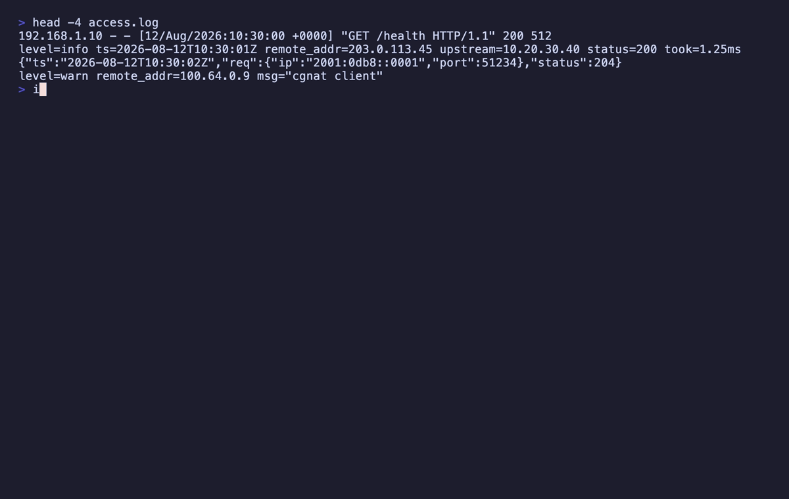

<p align="center">
  
</p>
<h1 align="center">IPs-LE: One Address, One Spelling</h1>
<p align="center">
  <b>Find every IP address, CIDR block and MAC in a document, normalized and classified, and refuse the ambiguous ones by name</b><br/>
  <i>IPv4 · IPv6 (RFC 5952) · CIDR · MAC — no DNS, no lookups, no sockets</i>
</p>

<p align="center">
  <a href="https://marketplace.visualstudio.com/items?itemName=nolindnaidoo.ips-le">
    
  </a>
  <a href="https://open-vsx.org/extension/nolindnaidoo/ips-le">
    
  </a>
  <a href="https://www.npmjs.com/package/ips-le-mcp">
    
  </a>
  <a href="https://crates.io/crates/ips-le">
    
  </a>
  <a href="https://letools.dev/tools/ips-le">
    
  </a>
</p>

---

> **Useful?** A star or rating is how other developers find it —
> [★ GitHub](https://github.com/nolindnaidoo/ips-le) ·
> [★ Open VSX](https://open-vsx.org/extension/nolindnaidoo/ips-le/reviews) ·
> [★ Marketplace](https://marketplace.visualstudio.com/items?itemName=nolindnaidoo.ips-le&ssr=false#review-details)

## What it does

An allow-list review asks whether `2001:0db8::0001` is already on the list. The list says `2001:db8::1`. A diff of the raw text calls them two addresses; they are one.

Open a document, run `IPs-LE: Extract Addresses`, and every IPv4 and IPv6 address, CIDR block and MAC address in it is listed by kind with its line and column, the key it sits under, its canonical form and what it is for — loopback, private, link-local, documentation and the rest. A CIDR block comes with its network, its last address and how many addresses it holds. The report opens beside the editor. Works in VS Code and in VS Code–based editors like Cursor and VSCodium (installable from Open VSX).

- **Reviewing a config or an allow-list** — one spelling per address, and the private ones named as private
- **Reading a log** — every peer and upstream, even inside a URL or a `[host]:port`
- **Before trusting `010.1.1.1`** — which is two different hosts depending on who reads it
- **Across a project** — every file that holds an address, and how many, in one table

**Text it cannot read unambiguously is reported with the reason, never guessed at.** **It resolves nothing, looks nothing up and rewrites nothing.**

## Install

| Where | What you get | Install |
|---|---|---|
| **VS Code** | The extraction, in your editor, on a keystroke | [Marketplace](https://marketplace.visualstudio.com/items?itemName=nolindnaidoo.ips-le) |
| **Cursor, VSCodium, Windsurf** | The same extension | [Open VSX](https://open-vsx.org/extension/nolindnaidoo/ips-le) |
| **A terminal or a CI step** | A whole tree, with an exit code | `cargo install ips-le` · [crates.io](https://crates.io/crates/ips-le) |
| **Any MCP agent, via Node** | `extract_ips` over stdio | `npx ips-le-mcp` · [npm](https://www.npmjs.com/package/ips-le-mcp) |

## What it answers

**One address, one form.** IPv6 is normalized per
[RFC 5952](https://www.rfc-editor.org/rfc/rfc5952) —
`2001:0db8:0000:0000:0000:0000:0000:0001`, `2001:db8:0:0:0:0:0:1`,
`2001:0db8::0001` and `2001:DB8::1` all come back as `2001:db8::1`.
Sorting the raw text gives four addresses; sorting the normalized form
gives one.

**Four kinds.** `ipv4`, `ipv6`, `cidr`, `mac`.

**Ten classes**, closed. A class this cannot name is a class it does not
claim.

| class | IPv4 | IPv6 |
|---|---|---|
| `loopback` | 127.0.0.0/8 | ::1 |
| `private` | 10/8, 172.16/12, 192.168/16 | — |
| `link-local` | 169.254/16 | fe80::/10 |
| `cgnat` | 100.64/10 | — |
| `multicast` | 224/4 | ff00::/8 |
| `broadcast` | 255.255.255.255 | — (IPv6 has none) |
| `documentation` | 192.0.2/24, 198.51.100/24, 203.0.113/24 | 2001:db8::/32 |
| `unique-local` | — | fc00::/7 |
| `reserved` | 0/8, 192.0.0/24, 198.18/15, 240/4 | ::, 2001::/23, 100::/64 |
| `global` | everything else | everything else |

An IPv4-mapped IPv6 address takes the IPv4 class, so `::ffff:127.0.0.1`
is `loopback` rather than `global` — which is the miss an allow-list
review is looking for.

**Where it is.** Line, column, and the key it sits under: JSON, YAML,
TOML, INI, dotenv, CSV and logs all supply one. Everything else is still
scanned — the search runs over the bytes, so a `.tf`, a `.rules` or a
rotated `access.log.1` yields its addresses and only loses the key path.

**Blocks, with their arithmetic.** A CIDR finding carries `prefix`,
`network`, `broadcast` (IPv4 only — IPv6 has none), `last` and `hosts`.
`hosts` is a decimal string, because `::/0` holds 2^128 addresses, which
is one more than a `u128` and far more than a JSON number.

```json
{
  "kind": "cidr",
  "text": "10.0.0.0/8",
  "normalized": "10.0.0.0/8",
  "class": "private",
  "cidr": {
    "prefix": 8,
    "network": "10.0.0.0",
    "broadcast": "10.255.255.255",
    "last": "10.255.255.255",
    "hosts": "16777216"
  }
}
```

## What it refuses

Where the text supports more than one reading, `ips-le` reports the
text, names the ambiguity, and stops.

Six reasons, each a place where two answers are equally defensible:

| reason | fires on |
|---|---|
| `octal_hazard` | `010.1.1.1`, `0177.0.0.1`, `192.168.001.1` |
| `ambiguous_version` | `10.0.1`, `1.2.3` — unless the key says version |
| `integer_form` | `2130706433` under an address key |
| `malformed_address` | `256.1.1.1`, `2001:db8:::1`, `12345::1` |
| `prefix_out_of_range` | `10.0.0.0/33`, `2001:db8::/129` |
| `mac_ambiguous` | `deadbeefcafe` |

The two that matter most:

- **`010.1.1.1` is not resolved.** A leading-zero octet is octal to some
  resolvers and decimal to others, so that text names two different
  hosts. Neither reading appears anywhere in the output — a tool that
  picked one would be the thing hiding the bug.
- **`2130706433` is decoded only next to the flag.** Under an address
  key it is reported as `integer_form`, with `127.0.0.1` inside the
  refusal message. What you never get is a loopback address quietly
  appearing in a list of addresses with the flag gone.

**A refusal is a finding, not a failure.** It does not move the exit
code, and no filter can hide it — filtering to `private` still shows you the
octal hazard, because that is the finding a filtered report would most
regret dropping. `--strict` is there for the pipeline that wants an
unresolved ambiguity to stop the build.

[`crate/SPEC.md`](crate/SPEC.md) says exactly when each reason fires.

## It never touches a network

No DNS, no geolocation, no ASN, no WHOIS, no reachability check, no
telemetry. Not behind a flag, not once. Classification is arithmetic
over the bits and the IANA registries; a lookup would make the answer
depend on the network the auditor happened to be sitting on.

It also never rewrites a file, and it never gives a verdict. It says
what an address *is*, never whether it should be there.

## Across a folder or a workspace

Extract reads the document you have open. A scan reads many files from disk and gives one report.

- **The whole workspace**: run `IPs-LE: Scan Workspace for Addresses` from the command palette.
- **One folder**: right-click it in the Explorer and choose `Scan Folder for Addresses`, or run `IPs-LE: Scan Folder for Addresses` and pick one.

The report opens with a table of every file that holds something, then has a section per file:

```markdown
# IPs-LE workspace report

`my-project` · 113 file(s) read · 2 address(es), 1 could not be read

| File | Addresses | Could not be read |
|---|---|---|
| `deploy/config.json` | 2 | 1 |

## `deploy/config.json` · json (2)

- **3:14** · `2001:0db8:0000:0000:0000:0000:0000:0001` · ipv6 · → `2001:db8::1` · documentation · key `upstream.host`
- **5:12** · `192.0.2.10` · ipv4 · documentation · key `peer`

> 2 file(s) larger than the safety limit were not read.
```

**What a scan reads.** Files come from disk, so an unsaved edit is not seen. A file over the safety size, or one that is not UTF-8 text, is left unread. It stops at 5,000 files or 10,000 listed addresses. The report ends with a line for each thing it left out, so a short report is never mistaken for a clean project.

**What it skips, and how to change that.** Three switches are on by default, and each can be turned off on its own in Settings:

| Switch | Skips |
|---|---|
| `scanUseDefaultExcludes` | Dependency folders, build output, tool caches and lockfiles. The full list is below |
| `scanRespectGitignore` | Whatever the project's `.gitignore` files skip |
| `scanSkipBinaryFiles` | Images, fonts, archives and other files that are not text |

Two lists adjust the result without turning a switch off. To skip more, add a pattern to `scanExcludes`. To read something a switch would skip, add it to `scanAlwaysInclude`:

```jsonc
{
	// Also skip the test fixtures.
	"ips-le.workspace.scanExcludes": ["**/fixtures/**"],
	// Read the vendored code, though the built-in list skips it.
	"ips-le.workspace.scanAlwaysInclude": ["**/vendor/**"]
}
```

`IPs-LE: Open Settings` opens all of these in the Settings editor.

<details>
<summary>The built-in list</summary>

Folders, wherever they appear:

<!-- built-in-folders -->
`.git`, `.hg`, `.svn`, `node_modules`, `bower_components`, `jspm_packages`, `.pnpm-store`, `.yarn`, `vendor`, `site-packages`, `Pods`, `Carthage`, `dist`, `build`, `out`, `target`, `_build`, `_site`, `dist-newstyle`, `zig-out`, `storybook-static`, `cdk.out`, `DerivedData`, `CMakeFiles`, `.next`, `.nuxt`, `.output`, `.svelte-kit`, `.angular`, `.astro`, `.docusaurus`, `.vuepress`, `.expo`, `.turbo`, `.parcel-cache`, `.cache`, `.sass-cache`, `.jekyll-cache`, `.dart_tool`, `.pub-cache`, `.gradle`, `.kotlin`, `.cxx`, `.externalNativeBuild`, `captures`, `ephemeral`, `.symlinks`, `.swiftpm`, `.build`, `.bundle`, `.stack-work`, `.zig-cache`, `.godot`, `elm-stuff`, `.vercel`, `.netlify`, `.serverless`, `.aws-sam`, `.terraform`, `.venv`, `venv`, `__pycache__`, `.tox`, `.nox`, `.mypy_cache`, `.pytest_cache`, `.ruff_cache`, `.ipynb_checkpoints`, `.eggs`, `coverage`, `htmlcov`, `.nyc_output`, `.vscode-test`, `.idea`, `.vs`, `xcuserdata`, `*.egg-info`
<!-- /built-in-folders -->

Files, wherever they appear:

<!-- built-in-files -->
`*.min.js`, `*.min.css`, `*.map`, `*.snap`, `*.lock`, `package-lock.json`, `pnpm-lock.yaml`, `npm-shrinkwrap.json`, `go.sum`, `*.pbxproj`, `*.iml`, `local.properties`, `output-metadata.json`, `.flutter-plugins`, `.flutter-plugins-dependencies`, `.packages`, `Generated.xcconfig`, `flutter_export_environment.sh`, `GeneratedPluginRegistrant.*`, `fastlane/report.xml`, `fastlane/test_output/**`, `doc/api/**`
<!-- /built-in-files -->

Not on the list, because they are ordinary folders in many projects: `bin`, `obj`, `tmp`, `logs`, `public`, `generated`. A project that generates those ignores them in git, and the scan reads `.gitignore`.

</details>

**What it could not read.** Across a project there can be many, and they crowd out the rest. So a scan counts them per file in the table and does not list them. `ips-le.workspace.scanIncludeRefusals` lists each one with its reason, and `ips-le.workspace.scanProblemsEnabled` also puts them in the Problems panel, where each is a line you can click.

The settings that shape a scan are under [Settings](#settings).

## Positions

Each row leads with the line and column of the address:

```markdown
- **3:14** · `2001:0db8:0000:0000:0000:0000:0000:0001` · → `2001:db8::1` · documentation · key `upstream.host`
```

Turn `ips-le.showPositions` off and the same row is:

```markdown
- `2001:0db8:0000:0000:0000:0000:0000:0001` · → `2001:db8::1` · documentation · key `upstream.host`
```

Nothing else changes: the same rows, the same counts. The copy on the clipboard is a separate choice, `ips-le.clipboardIncludesPositions`, so a report can show positions on screen and paste without them. Both apply to a scan as they do to Extract.

## Use it from an AI agent

The same engine runs as an [MCP](https://modelcontextprotocol.io) server, so an agent can call it directly instead of deciding by eye whether two spellings are one address.

| Editor | How |
|---|---|
| **VS Code** 1.101+ | Nothing to install — the extension registers `extract_ips` with agent mode |
| **Claude Code** | `claude mcp add ips-le -- npx -y ips-le-mcp` |
| **Cursor, Windsurf, anything else** | point it at `npx ips-le-mcp` |

```
extract_ips(content, format?, filename?, kind?, class?, maxResults?)
```

It returns the findings the editor renders, refusals included, as data — capped at 500 by default with `meta.truncated`. It reads no files and makes no network requests. Published as [`ips-le-mcp`](https://www.npmjs.com/package/ips-le-mcp) on npm and as `io.github.nolindnaidoo/ips-le` in the [MCP registry](https://registry.modelcontextprotocol.io). It answers exactly as the Rust CLI's server does: one corpus runs against both, and a differential test feeds both thousands of generated documents in every format — broken JSON included, where both report the parser's own words and position — and compares every answer.

<details>
<summary><b>Configuring it by hand</b> — any host with an MCP config file</summary>

```json
{
  "mcpServers": {
    "ips-le": {
      "command": "npx",
      "args": ["-y", "ips-le-mcp"]
    }
  }
}
```

Or install it once with `npm install -g ips-le-mcp` and point at `ips-le-mcp`. It needs no environment variables, no API key and no configuration of its own. To check it:

```bash
echo '{"jsonrpc":"2.0","id":1,"method":"tools/list"}' | npx -y ips-le-mcp
```

</details>

## The CLI

The same extraction runs over a whole tree from a terminal or a CI step: a Rust CLI in [`crate/`](crate/README.md), sharing one corpus with the extension — [`crate/fixtures/`](crate/fixtures/) — so the two can never read an address differently.

<p align="center">
  
</p>

```bash
ips-le .                                   # every address in the tree, one JSON line per file
ips-le --class private --class loopback .  # what should not be reachable
ips-le --kind cidr infra/                  # every block, with its arithmetic
ips-le --strict config/                    # exit 2 on any ambiguity
ips-le mcp                                 # extract_ips and ips_le_scan over MCP on stdio
```

**Exit codes follow grep** — 0 at least one address named, 1 none, 2 the question was malformed. A refusal does not move the exit code; `--strict` is how a pipeline turns one into a failure.

## Commands

| Command | Description |
|---|---|
| `IPs-LE: Extract Addresses` | Extract every address in the active document |
| `IPs-LE: Scan Workspace for Addresses` | Extract from every file in the workspace, one section per file |
| `IPs-LE: Scan Folder for Addresses` | The same for one folder. Also on a folder in the Explorer |
| `IPs-LE: Open Settings` | Open IPs-LE settings |
| `IPs-LE: Help & Troubleshooting` | Built-in documentation |

No command is bound to a key by default. Give any of them one under **Keyboard Shortcuts** in the editor.

## Settings

| Setting | Default | Description |
|---|---|---|
| `ips-le.kinds` | `[]` | Report only these kinds; empty reports every kind. Refusals are always reported |
| `ips-le.classes` | `[]` | Report only these classes; empty reports every class. Refusals are always reported |
| `ips-le.openResultsSideBySide` | `true` | Open the report beside the current editor |
| `ips-le.showPositions` | `true` | Show the line and column of each address |
| `ips-le.copyToClipboardEnabled` | `false` | Also copy the report to the clipboard |
| `ips-le.clipboardIncludesPositions` | `true` | Include the line and column in that copy |
| `ips-le.workspace.scanPatterns` | `["**/*"]` | The files a folder or workspace scan reads |
| `ips-le.workspace.scanUseDefaultExcludes` | `true` | Skip dependency folders, build output, caches and lockfiles |
| `ips-le.workspace.scanRespectGitignore` | `true` | Skip what the project's `.gitignore` files skip |
| `ips-le.workspace.scanSkipBinaryFiles` | `true` | Skip images, fonts, archives and other files that are not text |
| `ips-le.workspace.scanExcludes` | `[]` | More files to skip, as glob patterns |
| `ips-le.workspace.scanAlwaysInclude` | `[]` | Files to read even when one of the three above would skip them |
| `ips-le.workspace.scanMaxFiles` | `5000` | The most files one scan reads |
| `ips-le.workspace.scanMaxResults` | `10000` | The most addresses one scan lists before it stops reading |
| `ips-le.workspace.scanIncludeRefusals` | `false` | List each run that could not be read, not only how many per file |
| `ips-le.workspace.scanProblemsEnabled` | `false` | Also show the runs that could not be read in the Problems panel |
| `ips-le.safety.enabled` | `true` | Warn before extracting from a large file |
| `ips-le.safety.fileSizeWarnBytes` | `1000000` | The size that warning starts at |
| `ips-le.notificationsLevel` | `silent` | `all` = every notification, `important` = warnings + errors, `silent` = errors only |
| `ips-le.statusBar.enabled` | `true` | Show the status bar item |
| `ips-le.telemetryEnabled` | `false` | Local-only event log (see Privacy) |

## Languages

Twelve languages besides English:

German · Spanish · French · Indonesian · Italian · Japanese · Korean ·
Portuguese (Brazil) · Russian · Ukrainian · Vietnamese · Chinese (Simplified)

Both halves are covered — the manifest (command titles, setting names and descriptions) and everything shown while the extension runs (notifications, the status bar and the report's headings). A refusal's detail is the engine's English, identical to the CLI's.

## Privacy & security

- **No network access.** The extension never sends data anywhere: no DNS, no geolocation, no lookups of any kind. The `telemetryEnabled` setting only writes events to a local Output Channel you can inspect (`IPs-LE`).
- **The MCP server holds the same line.** It takes content as an argument and returns data: no filesystem access, no network calls, no telemetry.
- Error notifications redact home directories and credential-shaped fragments.
- **One rating prompt, at most twice.** On the 3rd successful use the extension asks once whether you would rate it, and once more on the 20th if you chose *Later* or dismissed it. *Don't Ask Again* ends it. Setting `notificationsLevel` to `important` or `silent` yourself turns it off. The counts are kept in VS Code's extension storage and nothing is sent anywhere; *Rate* opens the listing you installed from — the VS Code Marketplace or Open VSX — in your browser.

## Documentation

| What | Where |
|---|---|
| What the tool is allowed to say — kinds, classes, refusals, the output contract, non-goals | [`crate/SPEC.md`](crate/SPEC.md) |
| How the extension is built and held together — architecture, invariants, toolchain, release | [AGENTS.md](AGENTS.md) |
| How the CLI is built and held together | [`crate/AGENTS.md`](crate/AGENTS.md) |
| What changed | [CHANGELOG.md](CHANGELOG.md) · [`crate/CHANGELOG.md`](crate/CHANGELOG.md) |
| The tool's page, and the other fifteen | [letools.dev/tools/ips-le](https://letools.dev/tools/ips-le) |

## Performance

<!-- performance:start -->
| Input | Size | Found | Time | Rate | Scan speed |
| --- | --- | --- | --- | --- | --- |
| Access log | 3.42 MB | 80,000 | 155.25 ms | 515,312/sec | 22 MB/s |
| JSON config | 2.34 MB | 60,000 | 100.48 ms | 597,123/sec | 23.3 MB/s |
| Prose with no addresses | 2.51 MB | 40,000 | 70.2 ms | 569,780/sec | 35.7 MB/s |

Median of 7 runs after warmup, on Apple M5 Pro, 24 GB RAM, Node 24.3.0. Inputs are generated
by `scripts/benchmark.ts` rather than checked in, so the sizes above are
exactly what was measured. Reproduce with `bun run benchmark`.

These are machine-specific and are not asserted in CI — a benchmark that gates
a build only tells you how busy the runner was.
<!-- performance:end -->

## Testing

<!-- coverage:start -->
| Metric | Coverage |
| --- | --- |
| Statements | 86.59% |
| Branches | 79.59% |
| Functions | 93.56% |
| Lines | 88.22% |

195 test cases across 16 files, plus an integration suite that runs
in a real VS Code extension host and an end-to-end test that installs the
built `.vsix` into a clean profile.

Generated from a real run — `coverage/coverage-summary.json` and
`coverage/test-results.json` — by `scripts/coverage-readme.js`; CI fails if
this section drifts. Reproduce with `bun run test:coverage`, and the case
count is the one vitest prints.
<!-- coverage:end -->

## More from the LE family

Sixteen single-purpose tools for the work in front of every model. Each ships
a Rust CLI and an MCP server. One page: **[letools.dev](https://letools.dev)**

**Get it out**

- **[String-LE](https://letools.dev/tools/string-le)** — Extract every string in a codebase, with its position, so a person can read them
- **[Numbers-LE](https://letools.dev/tools/numbers-le)** — Extract every hardcoded number in a codebase, so a person can check them
- **[Units-LE](https://letools.dev/tools/units-le)** — Extract every quantity with its unit, normalized, and refuse the ambiguous ones by name
- **[Dates-LE](https://letools.dev/tools/dates-le)** — Extract every date and timestamp, and the exact instant each one resolves to
- **[IDs-LE](https://letools.dev/tools/ids-le)** — Extract every UUID, ULID, NanoID, ObjectId and Snowflake, and decode the time inside
- **[IPs-LE](https://letools.dev/tools/ips-le)** — Extract every IP address, CIDR block and MAC, normalized and classified by scope
- **[URLs-LE](https://letools.dev/tools/urls-le)** — Extract every URL in a codebase, with its protocol and exact position
- **[Paths-LE](https://letools.dev/tools/paths-le)** — Extract every file path in a codebase, and say whether it still points at anything
- **[Colors-LE](https://letools.dev/tools/colors-le)** — Extract every color in a codebase, and say which ones are not in your palette

**Check it**

- **[Regex-LE](https://letools.dev/tools/regex-le)** — Find every regex in a codebase, and report which can be driven into catastrophic backtracking
- **[Versions-LE](https://letools.dev/tools/versions-le)** — Find where one dependency is constrained differently across a repository's manifests
- **[i18n-LE](https://letools.dev/tools/i18n-le)** — Identify the i18n library a project uses, then audit its catalogs by that library's rules
- **[Scrape-LE](https://letools.dev/tools/scrape-le)** — Check whether a page is scrapeable before the scraper is written, and say when it cannot tell

**Guard it**

- **[Secrets-LE](https://letools.dev/tools/secrets-le)** — Find hardcoded credentials in a codebase, and never print one into the report
- **[EnvSync-LE](https://letools.dev/tools/envsync-le)** — Compare the dotenv files in a tree, and say which keys are missing from which
- **[Unicode-LE](https://letools.dev/tools/unicode-le)** — Find the Unicode that hides meaning — bidi controls, invisibles, homoglyphs, mixed scripts

Each stands on its own: no shared crate, no published core. Where two of them
agree, it is because the same answer was right twice.

**Contact** — [nolindnaidoo.com](https://nolindnaidoo.com) · [GitHub](https://github.com/nolindnaidoo) · [LinkedIn](https://www.linkedin.com/in/nolindnaidoo/)

## Also by nolindnaidoo

**Rust** — pixelcoords and pixelactions are one loop: pixelcoords answers
*where*, pixelactions *acts* there. Their own tools, their own voice — not
part of the LE family.

- **[pixelcoords](https://github.com/nolindnaidoo/pixelcoords)** — Freeze your screen, mark regions, get pixel-exact coordinates and crops
  [pixelcoords.dev](https://pixelcoords.dev) · [crates.io](https://crates.io/crates/pixelcoords) · [docs.rs](https://docs.rs/pixelcoords)
- **[pixelactions](https://github.com/nolindnaidoo/pixelactions)** — Consume human-verified coordinates, perform the interaction, confirm it landed
  [pixelactions.dev](https://pixelactions.dev) · [crates.io](https://crates.io/crates/pixelactions) · [docs.rs](https://docs.rs/pixelactions)

## License

MIT © [nolindnaidoo](https://github.com/nolindnaidoo)
